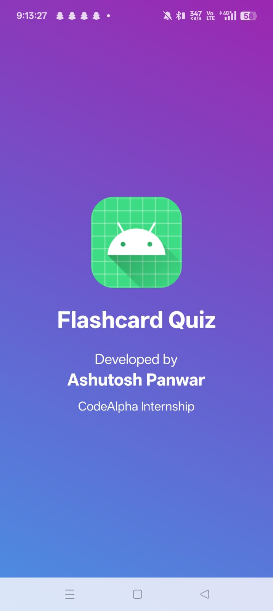
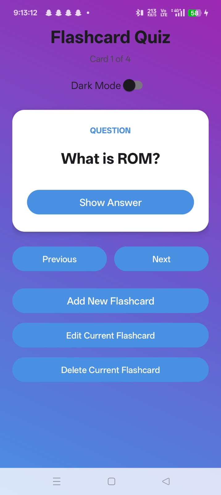
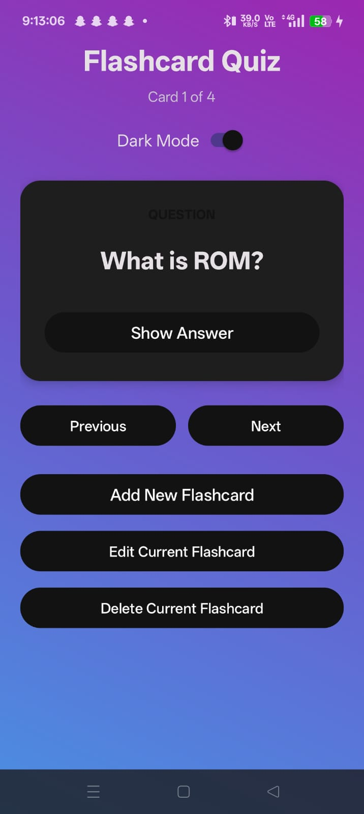
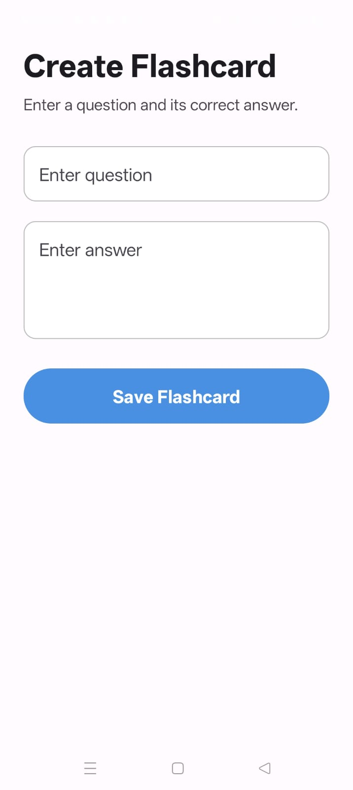
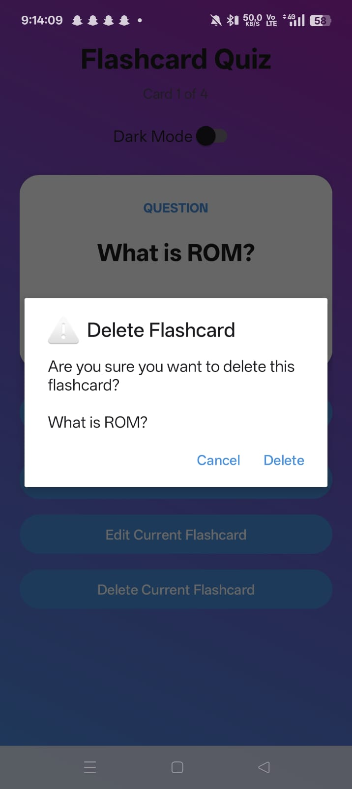

# 📚 Flashcard Quiz App

An Android Flashcard Quiz App built using Java, SQLite, and Android Studio as part of the CodeAlpha Android Development Internship.

## ✨ Features

- Create Flashcards
- View Flashcards
- Edit Flashcards
- Delete Flashcards
- Previous & Next Navigation
- Show/Hide Answer
- SQLite Database Storage
- Dark Mode Support
- Material Design UI
- Splash Screen

## 🛠️ Tech Stack

- Java
- Android Studio
- SQLite
- Material Design

## 📂 Project Structure

```
app/
├── java/
├── res/
├── AndroidManifest.xml
```

## 🚀 Installation

1. Clone the repository

```
git clone https://github.com/Ashutosh9-pan/FlashcardQuizApp.git
```

2. Open in Android Studio

3. Sync Gradle

4. Run the application

## 📸 Screenshots

### Splash Screen


### Main Screen (Light Mode)


### Main Screen (Dark Mode)


### Add Flashcard


### Delete Confirmation Dialog


## 👨‍💻 Developed By

**Ashutosh Panwar**

CodeAlpha Android Development Internship Project

## 📄 License

This project is developed for learning and internship purposes.
